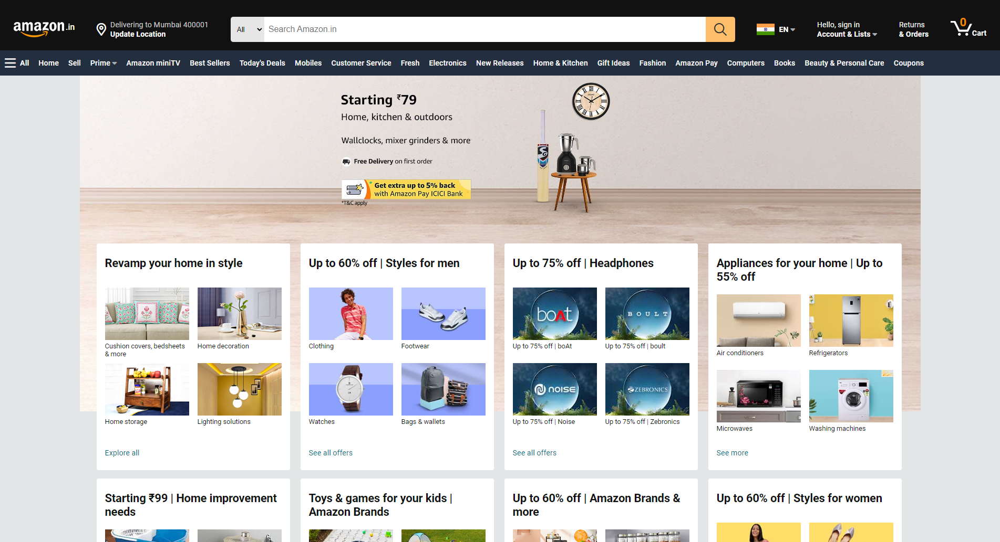

# Geekster Module 3 Geekathon01 by Team Amazon (Mentorship by Jaiten Sahu Sir)
## Project Information
Implemented [Amazon.in](https://www.amazon.in/) Website User Interface ! 

*Amazon is a globally renowned e-commerce platform that operates as an expansive online marketplace. Established in 1994, the platform has evolved into a comprehensive digital retail space, offering an extensive array of products ranging from books and electronics to fashion, home goods, and beyond. Functioning on a marketplace model, Amazon accommodates third-party sellers, enabling them to list and sell their products alongside Amazon's proprietary offerings.*

## Hosted Link:
 + [Amazon.in Website User Interface Clone](https://alex21c.github.io/AmazonClone/homepage/)

## Tech Stack Used
1. [HTML5](https://en.wikipedia.org/wiki/HTML5)
2. [CSS3](https://en.wikipedia.org/wiki/CSS)
3. [JavaScript ES6](https://en.wikipedia.org/wiki/JavaScript)
4. [Git](https://en.wikipedia.org/wiki/Git)
5. [AOS](https://michalsnik.github.io/aos/) - Animation on scroll
6. [Owl carousel](https://owlcarousel2.github.io/OwlCarousel2/)
7. [Clippy](https://bennettfeely.com/clippy/) (css clip-path maker)
8. [Font Awesome](https://fontawesome.com/icons)
9. [Google Fonts](https://fonts.google.com/)
10. [Google Translate](https://translate.google.co.in/)
11. [W3C Validator](https://validator.w3.org/)
12. [Visual Studio Code](https://code.visualstudio.com/)

## Mentor:
[Jaiten Sahu](https://www.linkedin.com/in/jaiten-sahu/) Sir 

## Team Info.
 1. [Abhishek kumar](https://www.linkedin.com/in/alex21c/) (Captain)
    1. [Homepage](https://alex21c.github.io/AmazonClone/homepage/)
    2. [Homepage (README)](https://alex21c.github.io/AmazonClone/homepage/README/)
 2. [Vipul Damre](https://www.linkedin.com/in/vipul-damre-2237241a7/)
    1. [Sell](https://alex21c.github.io/AmazonClone/sell/)
    2. [Sell (README)](https://alex21c.github.io/AmazonClone/sell/README/)
    3. [Best Sellers](https://alex21c.github.io/AmazonClone/bestSellers/)
    4. [Best Sellers (README)](https://alex21c.github.io/AmazonClone/bestSellers/README)
 3. Vaibhav Bisht
    1. [Best Sellers](https://alex21c.github.io/AmazonClone/bestSellers/)
    2. [Best Sellers (README)](https://alex21c.github.io/AmazonClone/bestSellers/README)
 4. [Savita](https://www.linkedin.com/in/savita-patidar-6aba721a0/)
    1. [Prime](https://alex21c.github.io/AmazonClone/prime/)
    2. [Prime (README)](https://alex21c.github.io/AmazonClone/prime/README/)
    3. [Customer Service](https://alex21c.github.io/AmazonClone/customerService/)
    4. [Customer Service (README)](https://alex21c.github.io/AmazonClone/customerService/README/)
 5. [Jitender Mangla](https://www.linkedin.com/in/jitender-mangla-58b6b216b/)
    1. [Customer Service](https://alex21c.github.io/AmazonClone/customerService/)
    2. [Customer Service (README)](https://alex21c.github.io/AmazonClone/customerService/README/) 
 6. [Mayank Kumar](https://www.linkedin.com/in/mayank-kumar-baa329217/)
    1. [miniTV](https://alex21c.github.io/AmazonClone/miniTV/)
    2. [miniTV (README)](https://alex21c.github.io/AmazonClone/miniTV/README/)
 7. [Chetan Kaushik](https://www.linkedin.com/in/chetan-kaushik-198317161/)
    1. [Mobiles](https://alex21c.github.io/AmazonClone/mobiles/)
    2. [Mobiles (README)](https://alex21c.github.io/AmazonClone/mobiles/README/)

## Credits
1. [Geekster](https://www.geekster.in/)
2. [Jaiten Sahu](https://www.linkedin.com/in/jaiten-sahu/) Sir (Mentor \| Geekster Geekathon Project Module #3 \| Amazon Clone)
3. [Akhil Sharma](https://www.linkedin.com/in/akhil-sh06/) Sir (Educator \| Geekster MERN Stack Bootcamp Module #3)
4. [Ankit Singh](https://www.linkedin.com/in/asingh88029/) Sir (TA \| Booster Session \| Geekster MERN Stack Bootcamp Module #3)
5. Our Success Managers: Yatharth Sir, Aanchal Parnami Mam
