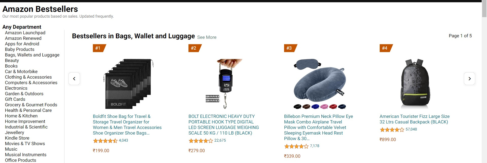

<!-- Name  -->
# Vipul Damre

## Amazon Clone
 (BESTSELLERS PAGE) hosted Link: [Bestsellers](https://alex21c.github.io/AmazonClone/bestSellers/index.html)

## Linkedin Link: 
[Vipul Damre](https://www.linkedin.com/in/vipul-damre-2237241a7/)

## Important tags used:
  ### 1 : HTML
  mostly in .html file i have used nested div tags for proper positioning and others tags like  p, span strong, h1, h2, h3, h4, ul, li etc.
  

  
  <strong>
  <h1><h2><h3><h4>
  

  

  ### 2 : CSS
  ####      a. flex-box
            use flex-box for alignment all the sections in this website
            file i have use flex-box, position: absolute and relative, display: none for responsiveness and many more.

  ####      b. media queries 
            Use a media queries for responsiveness of the website. like i use display: none for the items, when the particular width hit last item will be disappear this process continue till mobile screen 

 ####       c.  key frames
            Also use a animation for this bestSellers page like hovering effect can be done on the images using key frames 

## Techstack used 
	  HTML5
        CSS3
        fontawesome
        clippy for some shapes
        googleFonts

##  Screenshots:

   1. image 1:  
   2. image 2:  
   3. image 3:  
   4. image 4:   
   5. image 5:   
   6. image 6:   
   7. image 7:  

## Discription about images: 

1.      -- in the above image i have use flex box for positioning like  in the left side 1 div and right side 1 div, so in left div i use ul and li for links and in right div again create a div section for cards and in that cards div again create div for single card so that how i made the section of my web page

2.      all this nested div i have used in the bestSeller page by making it flex.

3.   for reponsiveness : in bestSeller page i have use display: none when the perticular width has been touch and add some height and width of heading tag and paragraph tag to make a font-size small

## Key Features: 

   1.  Responsive Design for Seamless User Experience
   2.  Intuitive Navigation and User-Friendly Interface
   3.  Sleek and Modern Look to Mimic the Amazon Vibe
   4.  Utilizing HTML5 and CSS3 for Cutting-Edge Development
   5.  Add some animations to be more user engaging.

##   Yours Learning 

 ### 1.  HTML :
       The main thing i have learn in the project that how we can make a html structure because without a strong skeleton whole body is not good fit for that we need to understand how to structure navbar or cards for that we can use div under divs divs under divs so that it can be properly structures

###  2.  Git and GitHub:
        The another thing i have learn while making project is how team work on the same project at a same time with different location by using git and github. command like pulling before pushing so that our code will upadate based on that code.

###  3.  CSS :
        before this project i have use units like px etc but by making this project i introduce to vmin and vmax, rem, % etc so this relative tags are very important for responsive website so mostly i have use vmin, rem & % and very less use of px unit or absolute units.

###  4. classes naming: 
        this is also very usefull for my pages like naming a classes is very important i have name a classes like 1st div is section1
        so 2nd div is section2
        if we created nested div in section2
              then
              .section2-items
                  s.ection2-items-card

         like that i have use classes naming.
