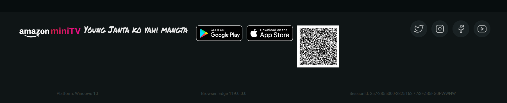
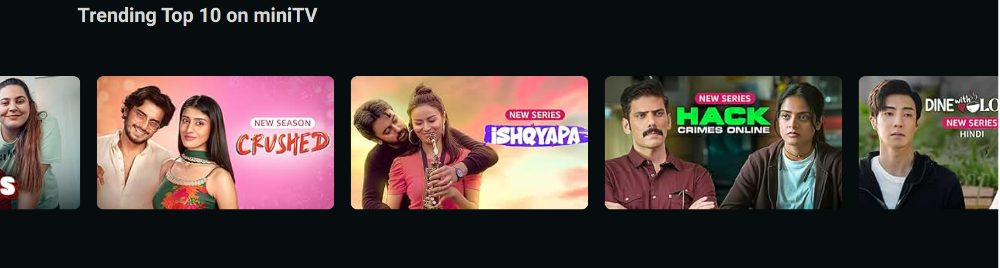

Mayank Kumar 

[Mayank Kumar](https://www.linkedin.com/in/mayank-kumar-baa329217/) \| [Amazon miniTV](https://alex21c.github.io/AmazonClone/miniTV/index.html/) \| [Geekster](https://www.geekster.in/) FS-14 Batch

This is the simple clone of Amazon website, 
This project, crafted using the latest web technologies such as HTML5 and CSS3, mirrors the sleek and intuitive design of Amazon's MiniTV platform. The use of HTML5 ensures a dynamic and interactive experience, while CSS3 stylings add a touch of modern elegance to the user interface and it's a Responsive website.

Important tags used in Amazon miniTV:

nav, 
figure,
main,
section,
footer,
nested div tags.

Techstack used:

HTML5, CSS3, FontAwesome, Owl_Carousel, Animation, Flex Properties 

Screenshot:
of webpage you designed (display where which css is used like flexbox, grid, little bit description)
 
 
.png>)

Description:

1st Image -- There are three items in the navBar and used flex properties. 
When we click on any of the link then colour will be changed because its targeting the ancor tag.
Added tooltip in the Icons.
Also there is hero_section which is done by the inbuild css3 Animation Keyframes and property I have used is "left"
which is used to horizontal positioning 0-5% after that it will moved to -110vw 10% then moved to -200vw and so on.position is relative. 

2nd Image -- I have used external javascript liberary owl_carousel and used flex properties position relative.
So that it gets slides.

3rd Image -- Footer section is all about images where I have just used flex properties to for alingment and add tooltip in the social images.

Yours Learning:

1.  Applied and learned flex properties for make the items inline and with help of that made the 3 sections of navbar.

2.  Learned to targating the links and made diffent color by clicking on navBar LinkText.

3.  Applied and learned how to use fontAwsome icons in the code.

4.   Used this tooltip in fontAwesome Icons and Social_Images which is on the footer    section.

5.  Used and Learned How to use the Owl_Caurousel "cdn" for making the slides of images using buttons.

6.  Used the Animation by using Keyframes.

7.  Used the Animation for the Auto Caurousel of the Images.

8. Learned and Applied the @mediaquery for making the website responsive.

Important Note:

- Team members are adviced to use Semantic tags
- proper commeting is required in css and html files within yours code, so that other team members can also understand
- it is adviced to make the webpage responsive as well you have chosen to design.
