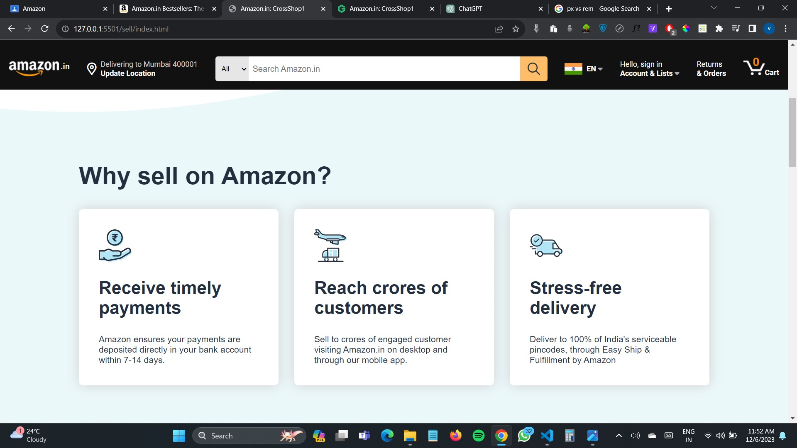

<!-- Name  -->
# Vipul Damre

## Amazon Clone (Sell Page) hosted Link: [Sell Page](https://alex21c.github.io/AmazonClone/sell/index.html)

## Linkedin Link: [Vipul Damre](https://www.linkedin.com/in/vipul-damre-2237241a7/)


## Important tags used:
 ### 1: HTML
  mostly in the .html files, I have used nested div tags for proper positioning and other tags like  p, span strong, h1, h2, h3, h4, ul, li, etc.
  ```html
  <p>
  <span>
  <strong>
  <h1><h2><h3><h4>
  <div>
  
  ```


### 2: CSS
  ####      a. flex-box
use flex-box for alignment of all the sections on this website
file I have used flex-box, position: absolute and relative, display: none for responsiveness, and many more.

  ####      b. media queries 
Use media queries for responsiveness of the website. like I use display: none for the items, when the particular width hit last item will disappear this process continues till mobile screen 

 ####       c.  keyframes
Also, use animation for this bestSellers page like a hovering effect can be done on the images using keyframes 

## Techstack used 
### 1. HTML5
### 2. CSS3
### 3. ScrollRevealjs and AOS libraries for Animation
### 3. font-awesome
### 5. google fonts
### 6. Git and GitHub


## Screenshots:

   1.  image1  : 
   2.  image 2 : 
   3.  image 3 : 
   4.  image 4 : 
   5.  image 5 :  
   6.  image 6 :  
   7.  image 7 :  
   8.  image 8 : 


## Description about images: 

 + -- In the above image I have used flexbox for positioning like in the left side 1 div and right side 1 div, so in the left div I use ul and li for links, and in the right div again create a div section for cards and in that cards, div again create div for the single card so that how I made the section of my web page

 


1. image : 
         In the 1st image, I used flexbox for positioning, and for that blue wave svg I used transform: scaleX to make it mirror view or flip it.
         and by applying transform: scaleX(1) on a downward div so that the content will appear front.


2. image : 
         In this image 2 I have just used nested divs for positioning by using flex-box and making each item border shadow.


3. image : 
         In this image, I use an iframe tag for adding a YouTube video but YouTube will already give an iframe tag to add videos on another website


4. image : 
         same as the 1st image I have used a wave as a background image and made its position absolute.


5. 5th, 6th, 7th and 8th image:
         above all these images of responsiveness with different widths.
         for responsiveness: in the sell page, I have added some height and width of the heading tag and paragraph tag to make a font size  small


## Key Features: 

   1.  Responsive Design for Seamless User Experience
   2.  Intuitive Navigation and User-Friendly Interface
   3.  Sleek and Modern Look to Mimic the Amazon Vibe
   4.  Utilizing HTML5 and CSS3 for Cutting-Edge Development
   5.  Add some animations to be more user-engaging.


## Yours Learning 


### 1 :  HTML :
  The main thing I have learn in the project that how we can make an HTML structure because without a strong skeleton whole body is not a good fit for that we need to understand how to structure the navbar or cards for that we can use div under divs divs under divs so that it can be properly structures


### 2 :  Git and GitHub:
   The another thing I have learned while making a project is how team work on the same project at a same time with different location by using git and github. command like pulling before pushing so that our code will upadate based on that code.


### 3 :  CSS :
   before this project i have use units like px etc but by making this project i introduce to vmin and vmax, rem, % etc so this relative tags are very important for the responsive websites so mostly i have use vmin, rem & % and very less use of px unit or absolute units.


### 4 : classes naming: 
   this is also very usefull for my pages like naming a classes is very important i have name a classes like 1st div is section1
   so 2nd div is section2
    if we created nested div in section2

```css
              
              .section2-items
                  .section2-items-card

```
like that i have use classes naming.

